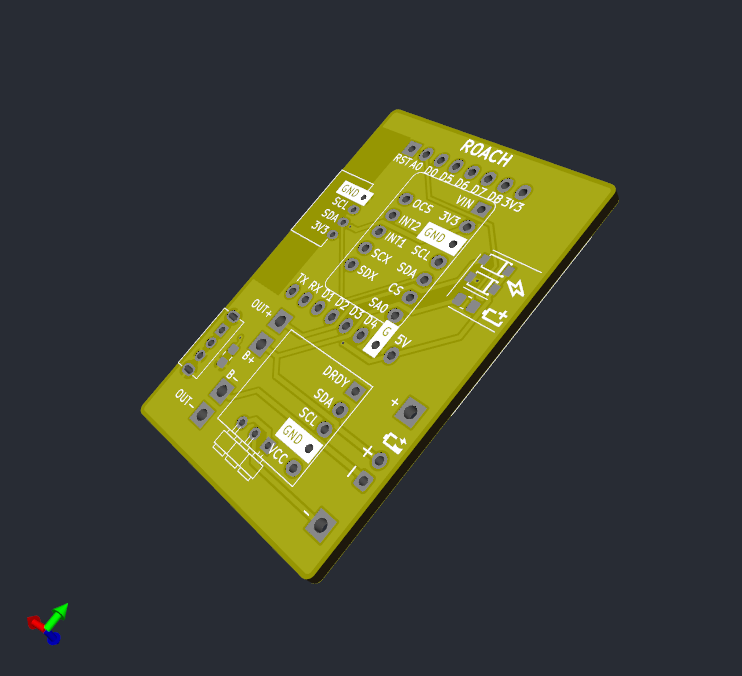
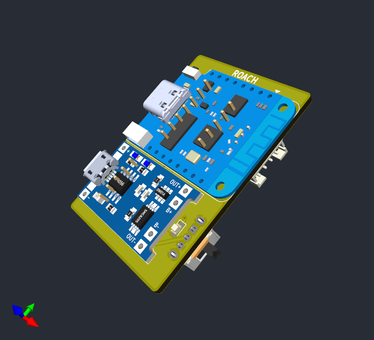
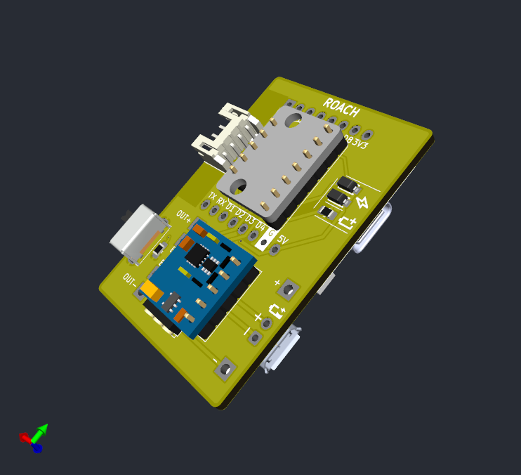
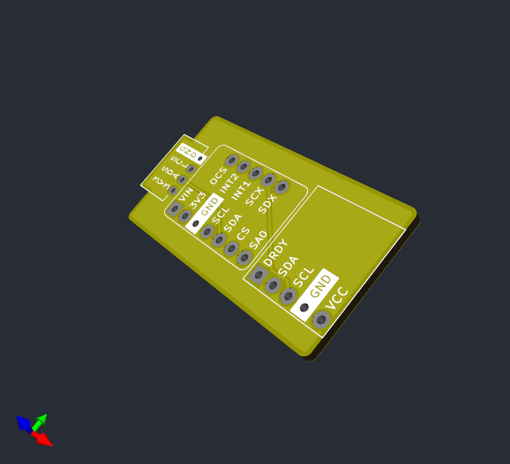
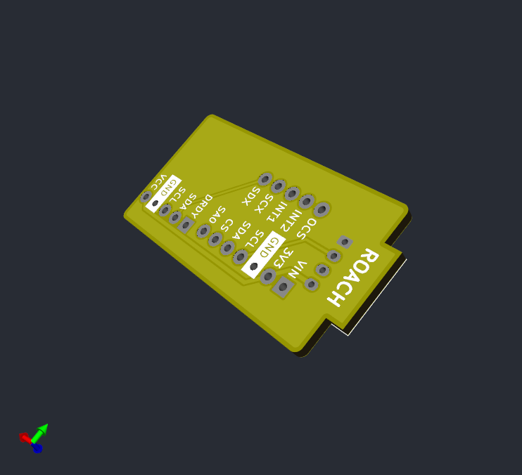
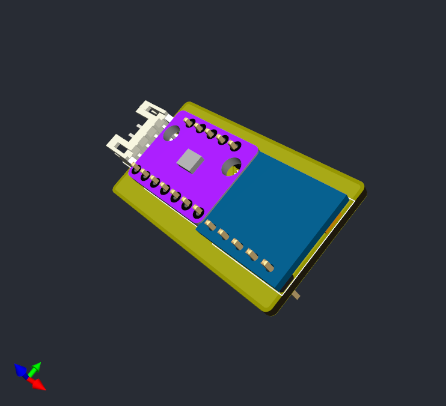
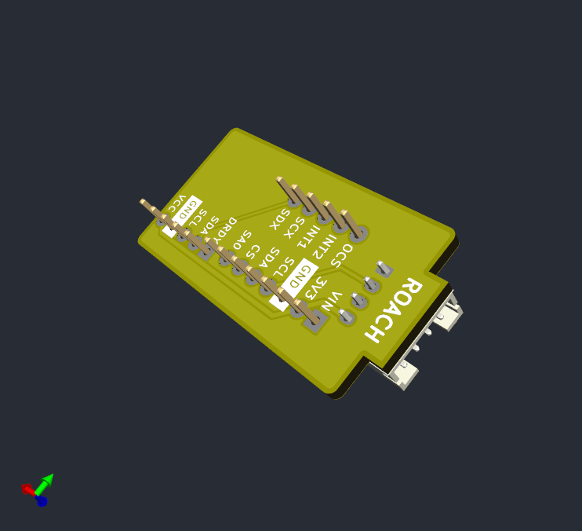

# roachslimes

A custom PCB for SlimeVR, with the intention of using the cheapest parts available in the smallest formfactor usable.

## Ordering PCBs

The included gerbers in /PCB/Production/ are exported from KiCad using the recommended settings for JLCPCB. I cannot guarantee that they will work at a different fab. JLCPCB is far and away the most cost effective for low volume PCB orders, coming out to $3.52 for 20 boards before tax if you use their economy shipping option(as of 2024).\

## Assembly

This board is designed to be compact, which means I had to make some unconventional choices during assembly. The D1 Mini and TP-4060 Boards are mounted to the surface of the PCB, while the BMI and QC are mounted on headers on the opposite side. For assembly, this means you have to solder the headers on first, then use flush cutters or snips to cut the header pins sticking out of the front of the board down to be flush so you can solder on the boards on the onto the front. There's also a pogo pin header for a future modular charging dock which would allow for charging multiple trackers at once, and a slot for an LED and associated resistor which was added for debugging but can be used to identify trackers if you choose to use different colored LEDs per tracker.

## Images

## Price Breakdown

Note that the LED and associated resistor, as well as the pogo pins are not necessary for core tracker operation, as specified in the comment row. 

| Tracker Componenets | [D1 Mini](https://www.aliexpress.us/item/32831353752.html) | [BMI160](https://www.aliexpress.us/item/1005007143698152.html) | [TP4056](https://www.aliexpress.us/item/1005006379403615.html) | [GY-271](https://www.aliexpress.us/item/1556804905.html) | [SK12D07VG4](https://www.aliexpress.us/item/3256806149664764.html) | [JST-PH-4P](https://www.aliexpress.us/item/33011797617.html) | [Pogo Female](https://www.aliexpress.us/item/3256804960956555.html) | [B5817WS](https://www.aliexpress.us/item/1005004633629467.html) | [0805 180k](https://www.aliexpress.us/item/1005007032369041.html) | [0806 620r](https://www.aliexpress.us/item/3256806846054289.html) | [0805 LED](https://www.aliexpress.us/item/3256805245629305.html) | [803450](https://www.aliexpress.us/item/1005003621836701.html) | [Wires](https://www.aliexpress.us/item/1005007558078161.html) | Motherboard | Daughterboard | Total |
| ------------------------------ | ---------------------------------------------------------- | -------------------------------------------------------------- | -------------------------------------------------------------- | -------------------------------------------------------- | ------------------------------------------------------------------ | ------------------------------------------------------------ | ------------------------------------------------------------------- | --------------------------------------------------------------- | ----------------------------------------------------------------- | ----------------------------------------------------------------- | ---------------------------------------------------------------- | -------------------------------------------------------------- | ------------------------------------------------------------- | ----------------------------- | --------------------------------- | ------------ |
| Listing Price | $ 1.43 | $ 0.88 | $ 3.27 | $ 0.58 | $ 1.20 | $ 3.79 | $ 12.93 | $ 1.20 | $ 1.05 | $ 1.05 | $ 2.47 | $ 25.99 | $ 11.93 | $ 2.00 | $ 2.00 | $ 71.77 |
| Shipping | $ 2.63 | $ 2.32 | $ \- | $ \- | $ \- | $ \- | $ \- | $ \- | $ \- | $ \- | $ \- | $ \- | $ \- | $ 1.52 | $ 1.52 | $ 7.99 |
| Subtotal | $ 15.50 | $ 12.88 | $ 3.27 | $ 6.96 | $ 1.20 | $ 3.79 | $ 12.93 | $ 1.20 | $ 1.05 | $ 1.05 | $ 2.47 | $ 25.99 | $ 11.93 | $ 3.52 | $ 3.52 | $ 107.26 |
| Tax | $ 1.28 | $ 1.06 | $ 0.27 | $ 0.57 | $ 0.10 | $ 0.31 | $ 1.07 | $ 0.10 | $ 0.09 | $ 0.09 | $ 0.20 | $ 2.14 | $ 0.98 | $ 0.29 | $ 0.29 | $ 8.85 |
| Total | $ 16.78 | $ 13.94 | $ 3.54 | $ 7.53 | $ 1.30 | $ 4.10 | $ 14.00 | $ 1.30 | $ 1.14 | $ 1.14 | $ 2.67 | $ 28.13 | $ 12.91 | $ 3.81 | $ 3.81 | $ 116.11 |
| Order Quantity | 9 | 12 | 1 | 12 | 1 | 1 | 1 | 1 | 1 | 1 | 1 | 1 | 1 | 1 | 1 | |
| Item Quantity | 1 | 1 | 20 | 1 | 20 | 100 | 20 | 100 | 100 | 100 | 600 | 10 | 12 | 20 | 40 | |
| Price Per Unit | $ 1.86 | $ 1.16 | $ 0.18 | $ 0.63 | $ 0.06 | $ 0.04 | $ 0.70 | $ 0.01 | $ 0.01 | $ 0.01 | $ 0.00 | $ 2.81 | $ 1.08 | $ 0.19 | $ 0.10 | |
| | | | | | | | | | | | | | | | | |
| Quantity Per Primary Tracker | 1 | 1 | 1 | 1 | 1 | 1 | 1 | 2 | 1 | 1 | 1 | 1 | 0 | 1 | 0 | |
| Quantity Per Secondary Tracker | 0 | 1 | 0 | 1 | 0 | 1 | 0 | 0 | 0 | 0 | 0 | 0 | 1 | 0 | 1 | |
| | | | | | | | | | | | | | | | | |
| Price Per Primary Tracker | $ 1.86 | $ 1.16 | $ 0.18 | $ 0.63 | $ 0.06 | $ 0.04 | $ 0.70 | $ 0.03 | $ 0.01 | $ 0.01 | $ 0.00 | $ 2.81 | $ \- | $ 0.19 | $ \- | $ 7.69 |
| Price Per Secondary Tracker | $ \- | $ 1.16 | $ \- | $ 0.63 | $ \- | $ 0.04 | $ \- | $ \- | $ \- | $ \- | $ \- | $ \- | $ 1.08 | $ \- | $ 0.10 | $ 3.00 |
| | | | | | | | | | | | | | | | | |
| Comment | | | | | | | Optional | | | Optional | Optional | | | | | |