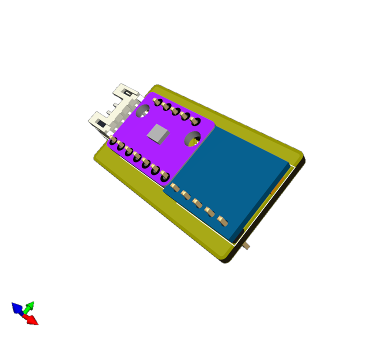

# roachslimes

A utilitarian tracker design for [SlimeVR](https://docs.slimevr.dev/), with the intention of using the cheapest parts available in the smallest formfactor usable.

## Disclaimer

The cases for these have yet to be rigorusly tested, and may require further revision.

## Ordering PCBs

The included gerbers in /PCB/Production/ are exported from KiCad using the recommended settings for [JLCPCB](https://jlcpcb.com). I cannot guarantee that they will work at a different fab. JLCPCB is far and away the most cost effective for low volume PCB orders, coming out to $3.52 for 20 boards before tax if you use their economy shipping option (as of 2024). There are four files, two for each board (one single board, and one panelized). Using the panelized board files is highly recommended, as it allows for More Board Per Board<sup>TM</sup> without additional cost. The default JLCPCB order parameters are good enough for working boards out of the box, but I'd recommend changing the color to yellow [(because it's lemon scented)](https://x.com/MKVRiscy/status/1821870120697987492) and to select "no mark" so you don't have some unique identifier printed on the board somewhere.

## Ordering Parts

Links to all required components can be found in the table futher down.

## Assembly

This board is designed to be compact, which means I had to make some unconventional choices during assembly. The D1 Mini and TP-4056 Boards are mounted to the surface of the PCB, while the BMI and QMC are mounted on headers on the opposite side. For assembly, this means you have to solder the headers on first, then use flush cutters or snips to cut the header pins sticking out of the front of the board down to be flush so you can solder on the boards on the onto the front. There's also a pogo pin header for a future modular charging dock which would allow for charging multiple trackers at once, and a slot for an LED and associated resistor which was added for debugging but can be used to identify trackers if you choose to use different colored LEDs per tracker. The cases are completely toolless and are friction/retention fit. Refer to the animation below for an assembly reference.


## Firmware

Firmware is pretty straightforward, though I did have an issue with the Butterscotch builder/installer - battery sense would always show 100 percent. Therefore, if you want all features to work, I'd recommend building it yourself - PlatformIO Tools for Visual Studio Code make it super easy. If you're compiling yourself, all you have to do is uncomment out ```BATTERY_SHIELD_RESISTANCE 180``` in ```defines.h```, set ```USE_6_AXIS false``` in ```debug.h```, and and change ```BMI160_MAG_TYPE BMI160_MAG_TYPE_HMC``` to ```BMI160_MAG_TYPE BMI160_MAG_TYPE_QMC```in ```defines_bmi160.h```. If that makes no sense to you, I've included compiled firmware in the releases section. 

## Price Breakdown

A fully parametric breakdown that allows for adjusting tax, quantity, and more can be found in BOM.xlsx or [here](https://docs.google.com/spreadsheets/d/1RTwIJsGUY1e1f047yFT5OwqJSmgT3SN4hO7gHYImR_g/copy) (if you want to modify it, you'll have to make a copy first).

All prices are in USD. Sales tax is calculated at 8.25%. The table includes 2 extra D1s, BMIs, and QMCs to account for possible DOA parts or accidents during assembly. Note that the LED and associated 620Ω resistor, as well as the pogo pins are not necessary for core tracker operation, as specified in the comment row.

| Tracker Components | [D1 Mini v4](https://www.aliexpress.us/item/32831353752.html) | [BMI160](https://www.aliexpress.us/item/1005007143698152.html) | [TP-4056](https://www.aliexpress.us/item/1005006379403615.html) | [GY-271](https://www.aliexpress.us/item/1556804905.html) | [SK12D07VG4](https://www.aliexpress.us/item/3256806149664764.html) | [JST-PH-4P](https://www.aliexpress.us/item/33011797617.html) | [Pogo Female](https://www.aliexpress.us/item/3256804960956555.html) | [B5817WS](https://www.aliexpress.us/item/1005004633629467.html) | [0805 180k](https://www.aliexpress.us/item/1005007032369041.html) | [0806 620r](https://www.aliexpress.us/item/3256806846054289.html) | [0805 LED](https://www.aliexpress.us/item/3256805245629305.html) | [803450](https://www.aliexpress.us/item/1005003621836701.html) | [Wires](https://www.aliexpress.us/item/1005007558078161.html) | Motherboard | Daughterboard | Total |
| ------------------------------ | ---------------------------------------------------------- | -------------------------------------------------------------- | -------------------------------------------------------------- | -------------------------------------------------------- | ------------------------------------------------------------------ | ------------------------------------------------------------ | ------------------------------------------------------------------- | --------------------------------------------------------------- | ----------------------------------------------------------------- | ----------------------------------------------------------------- | ---------------------------------------------------------------- | -------------------------------------------------------------- | ------------------------------------------------------------- | ----------------------------- | --------------------------------- | ------------ |
| Listing Price | $1.43 | $0.88 | $3.27 | $0.58 | $1.20 | $3.79 | $12.93 | $1.20 | $1.05 | $1.05 | $2.47 | $25.99 | $11.93 | $2.00 | $2.00 | |
| Shipping | $2.63 | $2.32 | $ \- | $ \- | $ \- | $ \- | $ \- | $ \- | $ \- | $ \- | $ \- | $ \- | $ \- | $1.52 | $1.52 | $7.99 |
| Subtotal | $15.50 | $12.88 | $3.27 | $6.96 | $1.20 | $3.79 | $12.93 | $1.20 | $1.05 | $1.05 | $2.47 | $25.99 | $11.93 | $3.52 | $3.52 | $107.26 |
| Tax | $1.28 | $1.06 | $0.27 | $0.57 | $0.10 | $0.31 | $1.07 | $0.10 | $0.09 | $0.09 | $0.20 | $2.14 | $0.98 | $0.29 | $0.29 | $8.85 |
| Total | $16.78 | $13.94 | $3.54 | $7.53 | $1.30 | $4.10 | $14.00 | $1.30 | $1.14 | $1.14 | $2.67 | $28.13 | $12.91 | $3.81 | $3.81 | $116.11 |
| Order Quantity | 9 | 12 | 1 | 12 | 1 | 1 | 1 | 1 | 1 | 1 | 1 | 1 | 1 | 1 | 1 | |
| Item Quantity | 1 | 1 | 20 | 1 | 20 | 100 | 20 | 100 | 100 | 100 | 600 | 10 | 12 | 20 | 40 | |
| Price Per Unit | $1.86 | $1.16 | $0.18 | $0.63 | $0.06 | $0.04 | $0.70 | $0.01 | $0.01 | $0.01 | $0.00 | $2.81 | $1.08 | $0.19 | $0.10 | |
| | | | | | | | | | | | | | | | | |
| Quantity Per Primary Tracker | 1 | 1 | 1 | 1 | 1 | 1 | 1 | 2 | 1 | 1 | 1 | 1 | 0 | 1 | 0 | |
| Quantity Per Secondary Tracker | 0 | 1 | 0 | 1 | 0 | 1 | 0 | 0 | 0 | 0 | 0 | 0 | 1 | 0 | 1 | |
| | | | | | | | | | | | | | | | | |
| Price Per Primary Tracker | $1.86 | $1.16 | $0.18 | $0.63 | $0.06 | $0.04 | $0.70 | $0.03 | $0.01 | $0.01 | $0.00 | $2.81 | $ \- | $0.19 | $ \- | $7.69 |
| Price Per Secondary Tracker | $ \- | $1.16 | $ \- | $0.63 | $ \- | $0.04 | $ \- | $ \- | $ \- | $ \- | $ \- | $ \- | $1.08 | $ \- | $0.10 | $3.00 |
| | | | | | | | | | | | | | | | | |
| Comment | | | | | | | Optional | | | Optional | Optional | | | | | |

## Gallery




## Credits

List of models used:

| Model | Credit |
|--|--:|
| Wemos D1 Mini v4 | [FBMinis](https://grabcad.com/library/wemos-esp8266-lolin-d1-mini-v4-1) |
| TP-4056 | [Babu George](https://grabcad.com/library/03962a-hw107-lithium-battery-charging-module-1) |
| BMI160 | [Kouno](https://store.kouno.xyz/products/bmi270-breakout-board) |
| GY-271 | [Benas Griauzde](https://grabcad.com/library/gy-271-hmc5883l-triple-3-axis-digital-compass-magnetometer-sensor-module-1) |
