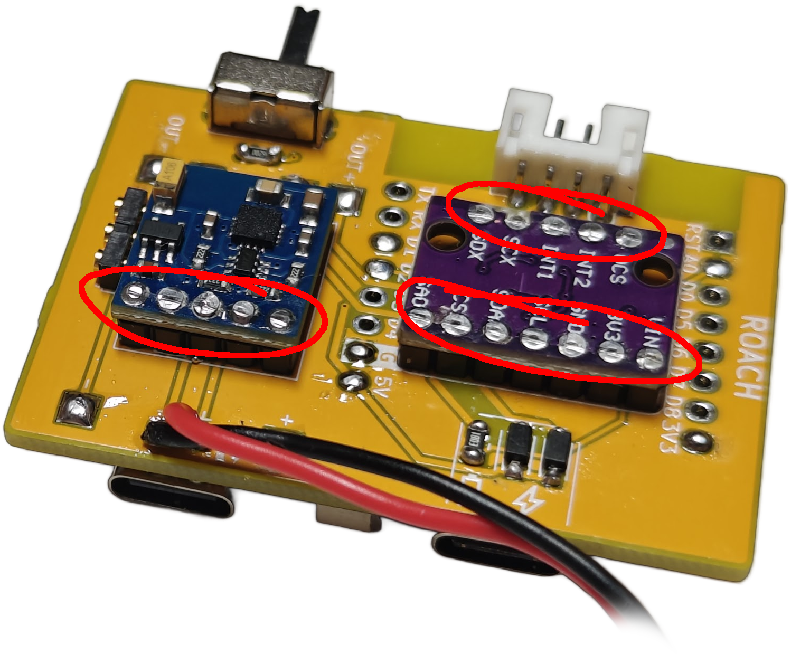

# Assembly

IMPORTANT NOTE: If you use the v2 compact cases, you **MUST** use flush cutters to cut the excess pin length coming out of the BMI and QMC (see picture below for an example), or you risk **puncturing the battery** which could burn you, your slimes, and your house down. Please use common sense and safe practices around lithium batteries. The v1 cases have a thin layer of plastic to prevent contact, but are a few mm taller. 

This board is designed to be compact, which means I had to make some unconventional choices during assembly. The D1 Mini and TP-4056 Boards are mounted to the surface of the PCB, while the BMI and QMC are mounted on headers on the opposite side. For assembly, this means you have to solder the headers on first, then use flush cutters or snips to cut the header pins sticking out of the front of the board down to be flush so you can solder on the boards onto the front. There's also a pogo pin header for a future modular charging dock which would allow for charging multiple trackers at once, and a slot for an LED and associated resistor which was added for debugging but can be used to identify trackers if you choose to use different colored LEDs per tracker. The cases are completely toolless and are friction/retention fit. Refer to the animation below for an assembly reference.

<video style="max-width: 730px;" src="videos/speen_mobo.mp4" autoplay loop muted></video>
