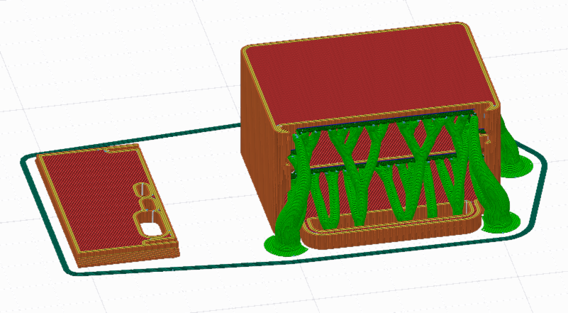
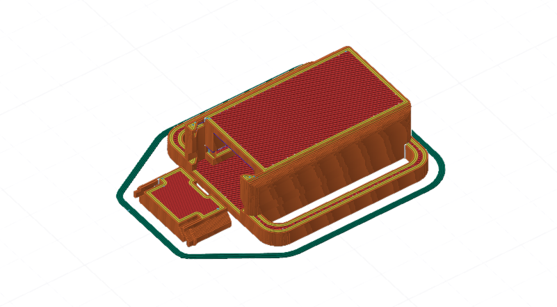

# 3D Printing Instructions

The print files, STLs, and Fusion source files are included in the [`/3D Files/`](https://github.com/crazy-hair/roachslimes/tree/main/3D%20Files) directory. I highly recommend using the `.3mf` print files as a basis for your print, as there are manually painted supports and custom settings per object (there's one `.3mf` for PrusaSlicer and friends and one for OrcaSlicer and friends).

TODO: add detailed breakdown of printing settings.

